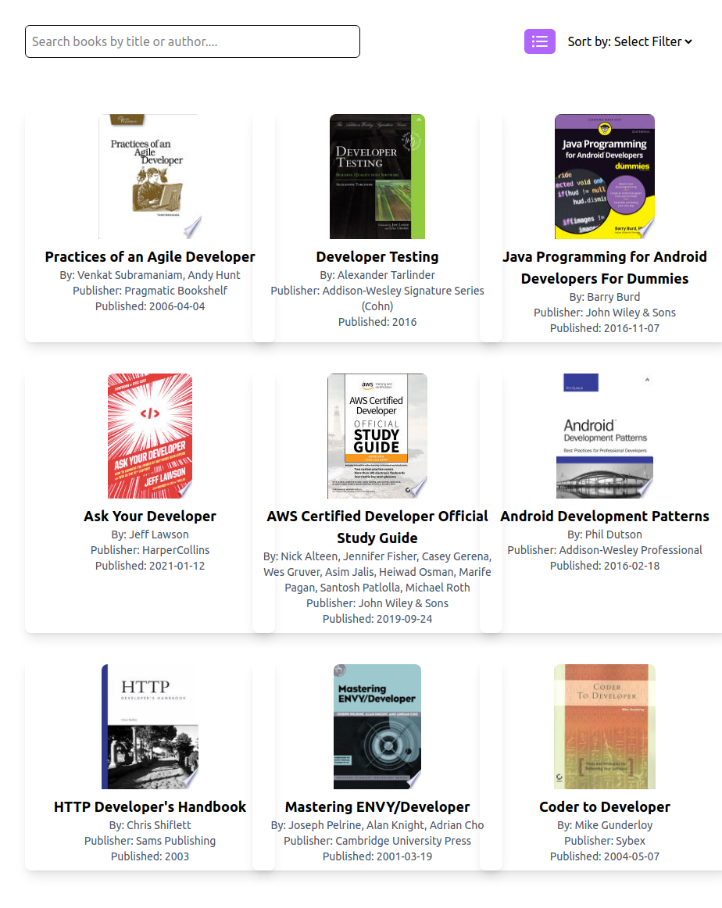
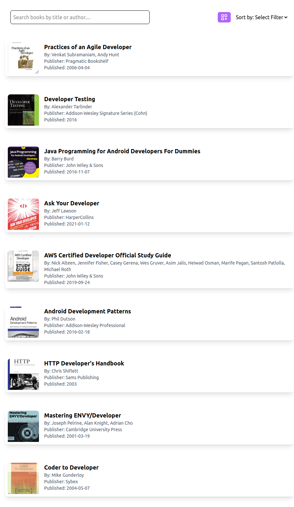
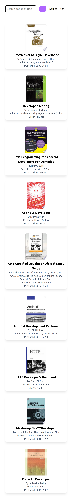
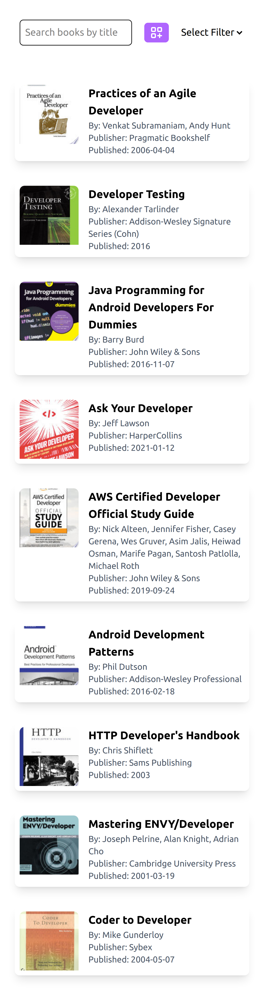

# Book Listing:

A simple web application that lists books , lets you sort and search by book title and author!

## Features:

- **Get Books**: Fetch books.
- **Search and Sort Books**: Search and Sort books by title or author.
- **Toggle Views**: Toggle view to Grid or List.

## Screenshots:

### Web-Page:

#### Grid-View:

#### List-View:

### Mobile-Page:

#### Grid-View:

#### List-View:

## Deployment Link:

You can access the live version of the app here:  
[Book Listing](https://boook-listing.netlify.app/)

## Technologies Used:

- HTML, CSS, and JavaScript for the front-end.
- Fetch API to get books.
